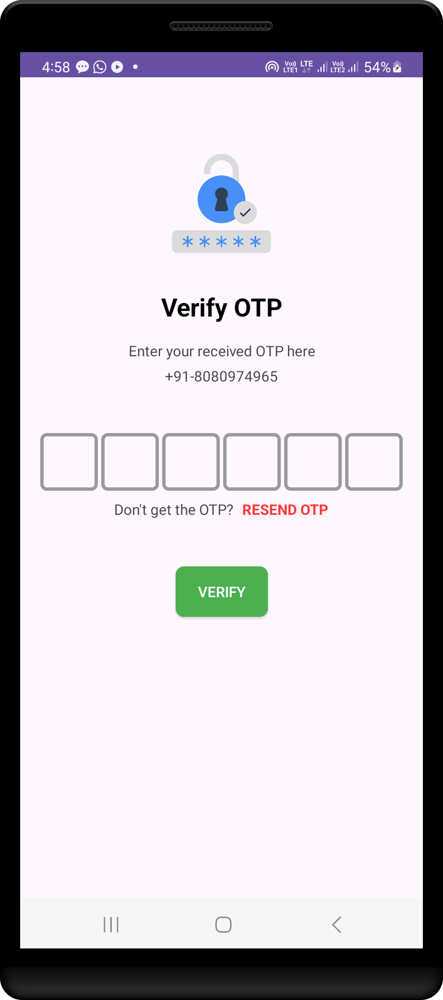

# Firebase OTP Verification in Android using Kotlin

A robust Android application that integrates Firebase for OTP (One-Time Password) verification. This project provides a seamless experience for phone number authentication with auto-retrieval of OTP, resend functionality, and a user-friendly interface.

## Features

- **Phone Number Authentication:** Secure user authentication via OTP sent to their phone number.
- **Auto OTP Retrieval:** Automatically retrieves the OTP from SMS for a smoother user experience.
- **Resend OTP:** Option to resend OTP in case the original message is missed.
- **Firebase Integration:** Utilizes Firebase Authentication for managing phone number verification.
- **Kotlin Implementation:** Entire app built using Kotlin, following best practices and clean code architecture.

## Screenshots
<table>
  <tr>
    <td></td>
    <td></td>
  </tr>
  <tr>
    <td></td>
    <td></td>
  </tr>
  <tr>
    <td colspan="2"></td>
  </tr>
</table>


## Prerequisites

- **Android Studio:** Latest version recommended.
- **Firebase Project:** You need to have a Firebase project set up.
- **Google Play Services:** Ensure that Google Play Services is updated on the device.

## Getting Started

Follow these steps to set up the project locally:

### 1. Clone the Repository

```bash
https://github.com/samyak2403/Firebase-OTP-Verifaction.git
cd Firebase-OTP-Verifaction-repository
```


# Firebase OTP Verification in Android (Kotlin)

This project demonstrates how to implement OTP (One-Time Password) verification in an Android application using Firebase Authentication.

## Table of Contents
- [Prerequisites](#prerequisites)
- [Setup Firebase in Your Project](#setup-firebase-in-your-project)
- [Add Required Dependencies](#add-required-dependencies)
- [Implement OTP Verification](#implement-otp-verification)
- [Project Structure](#project-structure)
- [License](#license)

## Prerequisites
- Android Studio (latest version)
- A Firebase account
- Basic knowledge of Kotlin and Android development


## Setup Firebase in Your Project

1. **Create a Firebase Project:**
   - Go to the [Firebase Console](https://console.firebase.google.com/).
   - Click on **Add Project** and follow the instructions to create a new project.

2. **Add Your Android App to Firebase:**
   - In the Firebase Console, select your project and click on **Add App**.
   - Choose **Android** and enter your app's package name.
   - Download the `google-services.json` file and place it in the `app/` directory of your Android project.

3. **Generate SHA-256 Key:**
   - Open a terminal and run the following command:
     ```bash
     keytool -list -v -alias androiddebugkey -keystore ~/.android/debug.keystore
     ```
   - If prompted for a password, use `android` (default password).
   - Copy the SHA-256 key from the output.
   - In the Firebase Console, navigate to `Project Settings > General`. Under the **Your apps** section, click on **Add Fingerprint** and paste the SHA-256 key.

4. **Enable Phone Authentication:**
   - In the Firebase Console, go to `Authentication > Sign-in method`.
   - Enable the **Phone** sign-in provider.

## Add Required Dependencies

1. **Add Google services classpath:**
   - In your project-level `build.gradle` file, add the following:

     ```groovy
     buildscript {
         repositories {
             google()
             mavenCentral()
         }
         dependencies {
             classpath 'com.google.gms:google-services:4.3.15' // Check for the latest version
         }
     }
     ```

2. **Add Firebase dependencies:**
   - In your app-level `build.gradle` file, add the Firebase dependencies:

     ```groovy
     plugins {
         id 'com.android.application'
         id 'kotlin-android'
         id 'com.google.gms.google-services'
     }

     dependencies {
         implementation platform('com.google.firebase:firebase-bom:32.0.0') // Check for the latest version
         implementation 'com.google.firebase:firebase-auth-ktx'
     }
     ```

   ##  Modify AndroidManifest.xml
     Add the following permissions and receivers:
    ```xml                     
   <uses-permission android:name="android.permission.RECEIVE_SMS"/>
<uses-permission android:name="android.permission.READ_SMS"/>

<application>
    ...
    <receiver
        android:name=".OTP_Receiver"
        android:exported="true"
        android:permission="com.google.android.gms.auth.api.phone.permission.SEND"/>
</application>
 ``` 

4. **Sync your project:** After adding the dependencies, sync your project in Android Studio.


## Implement OTP Verification

Follow the steps below to implement OTP verification in your Android app:

1. **Request OTP:**
   - Use Firebase Authentication to send an OTP to the user's phone number.

2. **Verify OTP:**
   - Allow the user to input the OTP and verify it using Firebase Authentication.

For detailed code examples, refer to the official Firebase documentation or the project’s source code.

## Project Structure:
 ```app
app/
├── src/main/java/app/my/otpverification/
│   ├── OtpSendActivity.kt       # Handles sending OTP
│   ├── OtpVerifyActivity.kt     # Handles OTP verification
│   ├── OTP_Receiver.kt          # BroadcastReceiver for SMS retrieval
│   └── MainActivity.kt          # Post-authentication main screen
└── src/main/res/layout/         # XML layouts for activities
 ```


## License

This project is licensed under the MIT License - see the [LICENSE](LICENSE) file for details.
